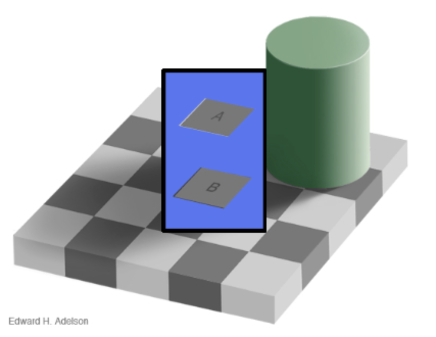
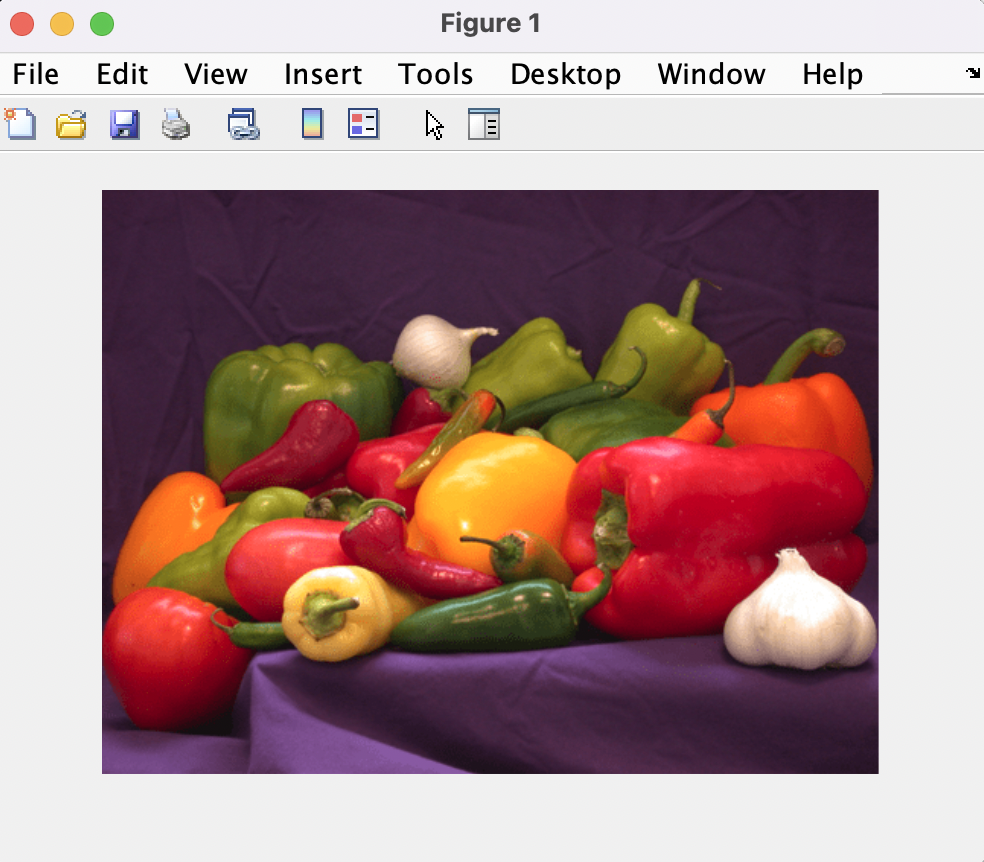
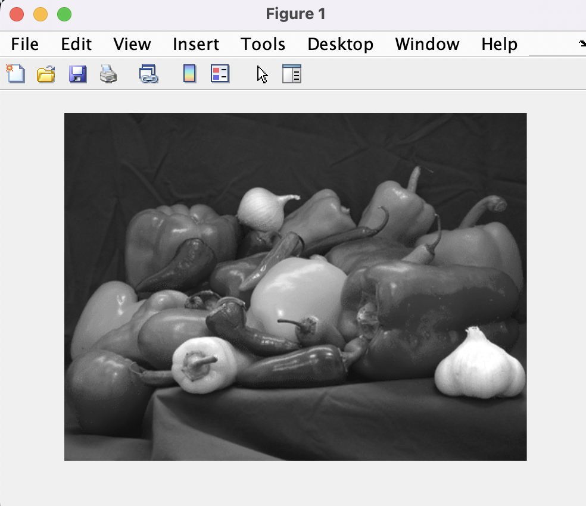
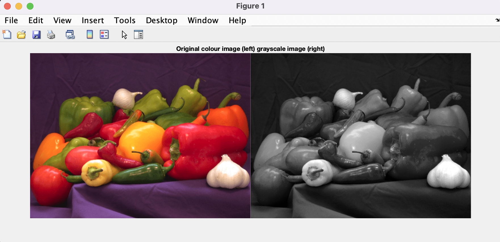
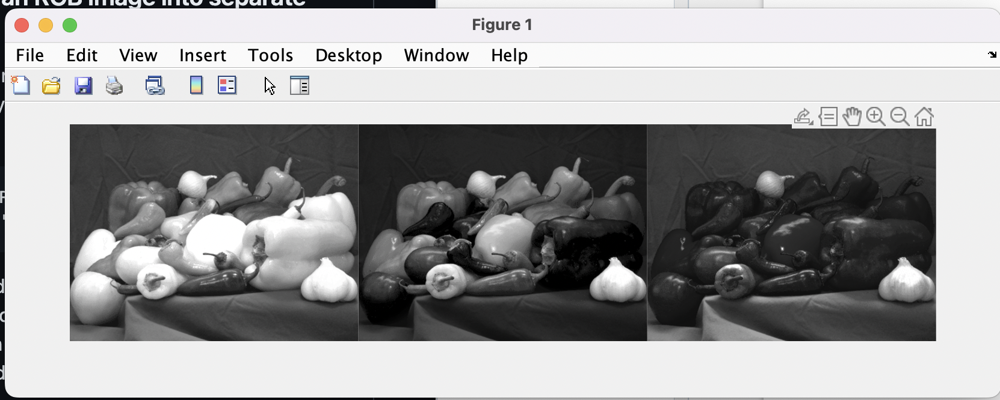
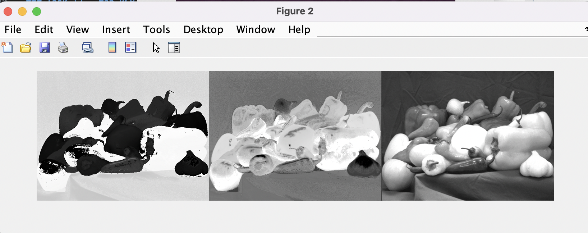
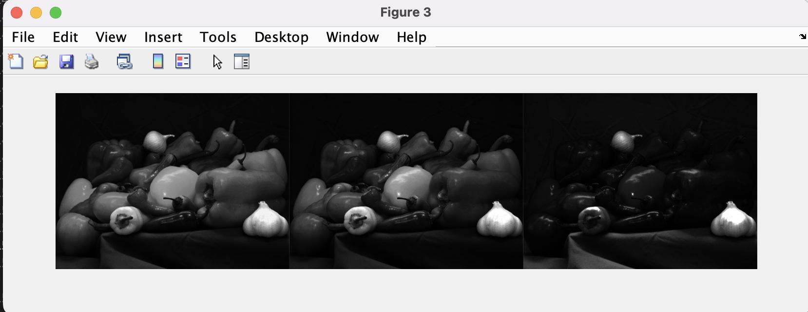

# Lab 2 - Colour and Perception

---
## Part 1 - Seeing Colours and Shapes
---

### Task 1 - Find your blind spot
From watching and interacting with this video I was able to identify my blind spot.
I was shocked to see how my blindspot was engaged especially when I became unable to see symbols, which were replaced with the colour red.

### Task 2 - Ishihara Colour Test
Although the last plate was difficult for me, I correctly identified all numbers.

### Task 3 - Reverse colour
This occured because my cone cells become fatigued and overstimulated. This leads to a negative after image impression. 

### Task 4 - Troxler's Fading
Troxler's fading occurs becaise the neurons behind rods and cones have large receptive fields, meaning the small involuntary eye movements when fixating on something fail to move the stimulus onto a new cell's receptive field. This effect is attributed to the adaption of neurons.

The first video I was able to see the purple circles "mopped up" by the green.
The second video I was able to see the blue ring disappear.

### Task 5 - Brain sees what it expects
The tables are the same size, but because we expect the tables to be different sizes, that is what we see. This is because we decode them according to the rules for three-dimensional objects.

A and B are the same colour. See here:<BR>
<p align = "centre"></p><BR>

This is because we have a visual expectation of what the colour would be based on the precident set in the rest of the image, implying that the shades would be different. 

### Task 6 - The Grid Illusion
This illusion is called a scintillating grid illusion. This is when dark dots seem to appear and disappear rapidly at random intersections. The effect is often explained by lateral inhibition, where a group of receptors respond to the presentation of stimuni in the receptive feild. Another theory is retinal ganglion cell theory, but is found untenable when making the grid wavy. There is a new hypothesis also, involving the blindspot.

### Task 7 - Cafe Wall Illusion
This is largely attributed to an irradiation illusion. This is when contrast are the determining factor in the tilt's direction.

### Task 8 - the Silhouette Illusion
This illusion cmes from lack of visual information about the depth of the image. The lack of visual cues gives this illusion ambiguity.

### Task 9 - the Incomplete Triangles
This illusion evokes our expectaition of shape, and defines a form without lines by making us complete the shape.

---
## Part 2 - Exploring Colours in Matlab
---

### Task 10 - Convert RGB image to Grayscale

Input
```
imfinfo('peppers.png')
```

Output
```
ans = 

  struct with fields:

                  Filename: '/Users/AmyBrons/Documents/GitHub/Lab2-Colour-Perception/matlab/peppers.png'
               FileModDate: '23-Jan-2025 14:06:39'
                  FileSize: 711722
                    Format: 'png'
             FormatVersion: []
                     Width: 777
                    Height: 584
                  BitDepth: 24
                 ColorType: 'truecolor'
           FormatSignature: [1×8 double]
                  Colormap: []
                 Histogram: []
             InterlaceType: 'none'
              Transparency: 'alpha'
    SimpleTransparencyData: []
           BackgroundColor: []
           RenderingIntent: []
            Chromaticities: []
                     Gamma: []
               XResolution: []
               YResolution: []
            ResolutionUnit: []
                   XOffset: []
                   YOffset: []
                OffsetUnit: []
           SignificantBits: []
              ImageModTime: []
                     Title: []
                    Author: []
               Description: []
                 Copyright: []
              CreationTime: []
                  Software: []
                Disclaimer: []
                   Warning: []
                    Source: []
                   Comment: []
                 OtherText: {1×2 cell}
         AutoOrientedWidth: 777
        AutoOrientedHeight: 584
```

Input
```
RGB = imread('peppers.png');  
imshow(RGB)
```
Output<BR>
<p align="center"></p><BR>

Input
```
I = rgb2gray(RGB);
figure              % start a new figure window
imshow(I)
```
Output<BR>
<p align="center"></p><BR>

Input
```
imshowpair(RGB, I, 'montage')
title('Original colour image (left) grayscale image (right)');
```
Output<BR>
<p align="centre"></p><BR>


### Task 11 - Splitting an RGB image into separate channels

Input
```
[R,G,B] = imsplit(RGB);
montage({R, G, B},'Size',[1 3])
```
Output<BR>
<p align="center"></p>
<BR>
R,G,B and I all have dimensions of 584X777 unit8. All of channels all contain different values in their matrices. 

### Task 12 - Map RGB image to HSV space and into separate channels

Input
```
HSV = rgb2hsv(RGB);
[H,S,V] = imsplit(HSV);
montage({H,S,V}, 'Size', [1 3])
```

Output<BR>
<p align="center"></p><BR>


### Task 13 - Map RGB image to XYZ space

Input
```
XYZ = rgb2xyz(RGB);
[X,Y,Z] = imsplit(XYZ);
montage({X,Y,Z}, 'Size', [1 3])
```

Output<BR>

<p align="center"></p><BR>

Comments: 
This converts RGB values to CIE 1931 XYZ values. Together, the image looks faded. When apart these channels look grey.

FULL MATLAB CODE:

```
%___Task 10___

%Image info
imfinfo('peppers.png')

%image shpw
RGB = imread('peppers.png');  
imshow(RGB)

%convert to grey
I = rgb2gray(RGB);
figure              % start a new figure window
imshow(I)

%print pair side-by-side
imshowpair(RGB, I, 'montage')
title('Original colour image (left) grayscale image (right)')


%___Task 11___

%split RGB channels
[R,G,B] = imsplit(RGB);
montage({R, G, B},'Size',[1 3])

%convert to HSV
HSV = rgb2hsv(RGB);
[H,S,V] = imsplit(HSV);
montage({H,S,V}, 'Size', [1 3])

%___Task 13___

%map xyz
XYZ = rgb2xyz(RGB);
[X,Y,Z] = imsplit(XYZ);
montage({X,Y,Z}, 'Size', [1 3])

```
